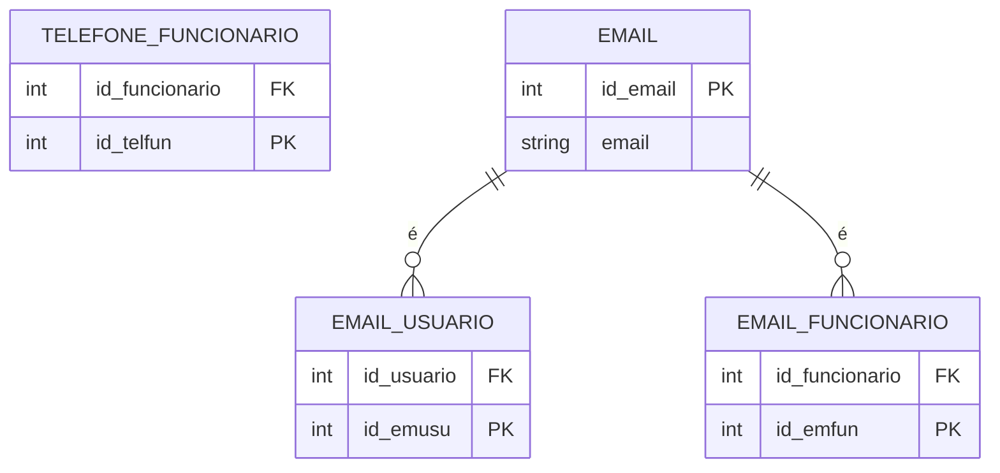

```mermaid
erDiagram
    TELEFONE_FUNCIONARIO {
        int id_funcionario FK
        int id_telfun PK
    }
    EMAIL ||--o{ EMAIL_USUARIO : é
    EMAIL ||--o{ EMAIL_FUNCIONARIO : é
    EMAIL {
        int id_email PK
        string email
    }
    EMAIL_USUARIO {
        int id_usuario FK
        int id_emusu PK
    }
    EMAIL_FUNCIONARIO {
        int id_funcionario FK
        int id_emfun PK
    }
```
