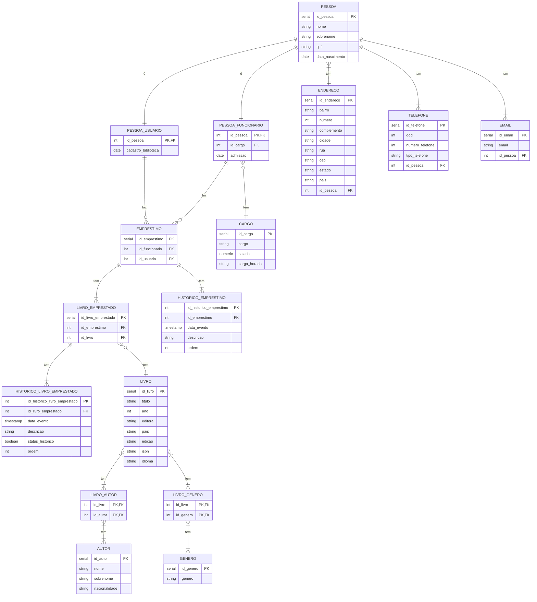

```mermaid
erDiagram
    PESSOA_USUARIO ||--o{ EMPRESTIMO : faz
    PESSOA_FUNCIONARIO ||--o{ EMPRESTIMO : faz
    EMPRESTIMO ||--|{ LIVRO_EMPRESTADO : tem
    EMPRESTIMO ||--|{ HISTORICO_EMPRESTIMO : tem
    PESSOA_FUNCIONARIO }o--|| CARGO : tem
    PESSOA ||--|| PESSOA_USUARIO : é
    PESSOA ||--|| PESSOA_FUNCIONARIO : é
    PESSOA }|--|| ENDERECO : tem
    PESSOA ||--|{ TELEFONE : tem
    PESSOA ||--|{ EMAIL : tem
    LIVRO_EMPRESTADO ||--|{ HISTORICO_LIVRO_EMPRESTADO  : tem
    LIVRO_EMPRESTADO }o--|| LIVRO  : tem
    LIVRO }|--|{ LIVRO_AUTOR: tem
    LIVRO_AUTOR }|--|{ AUTOR: tem
    LIVRO }|--|{ LIVRO_GENERO: tem
    LIVRO_GENERO }|--|{ GENERO: tem


    CARGO {
        serial id_cargo PK
        string cargo
        numeric salario
        string carga_horaria
    }

    PESSOA {
        serial id_pessoa PK
        string nome
        string sobrenome
        string cpf
        date data_nascimento
    }

    PESSOA_FUNCIONARIO {
        int id_pessoa PK, FK
        int id_cargo FK
        date admissao
    }

    PESSOA_USUARIO {
        int id_pessoa PK, FK
        date cadastro_biblioteca
    }

    EMPRESTIMO {
        serial id_emprestimo PK
        int id_funcionario FK
        int id_usuario FK
    }

    HISTORICO_EMPRESTIMO {
        int id_historico_emprestimo PK
        int id_emprestimo FK
        timestamp data_evento
        string descricao
        int ordem
    }

    LIVRO_EMPRESTADO {
        serial id_livro_emprestado PK
        int id_emprestimo FK
        int id_livro FK
    }

    HISTORICO_LIVRO_EMPRESTADO {
        int id_historico_livro_emprestado PK
        int id_livro_emprestado FK
        timestamp data_evento
        string descricao
        boolean status_historico
        int ordem
    }

    AUTOR {
        serial id_autor PK
        string nome
        string sobrenome
        string nacionalidade
    }

    LIVRO {
        serial id_livro PK
        string titulo
        int ano
        string editora
        string pais
        string edicao
        string isbn
        string idioma
    }

    GENERO {
        serial id_genero PK
        string genero
    }

    LIVRO_AUTOR {
        int id_livro PK, FK
        int id_autor PK, FK
    }

    LIVRO_GENERO {
        int id_livro PK, FK
        int id_genero PK, FK
    }

    ENDERECO {
        serial id_endereco PK
        string bairro
        int numero
        string complemento
        string cidade
        string rua
        string cep
        string estado
        string pais
        int id_pessoa FK
    }

    TELEFONE {
        serial id_telefone PK
        int ddd
        int numero_telefone
        string tipo_telefone
        int id_pessoa FK
    }

    EMAIL {
        serial id_email PK
        string email
        int id_pessoa FK
    }

```
