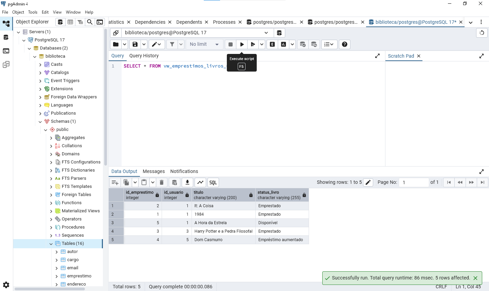

# Projeto Final: Banco de Dados Relacional - Biblioteca  

# *Introdução & objetivo*

Este projeto visa o desenvolvimento de uma plataforma interativa para o acompanhamento de pedidos de veículos Toyota. A aplicação será acessível em três modos: **Visitante**, **Cliente** e **Colaborador**, cada um com funcionalidades específicas e adaptadas às necessidades dos usuários.

O objetivo é criar uma experiência digital completa que permita o acompanhamento de pedidos de veículos desde a solicitação até a entrega, promovendo transparência, interatividade e facilidade de uso. A proposta se diferencia por oferecer um acompanhamento detalhado, gamificação da jornada e suporte tanto automatizado quanto humano.

# *Por que* implementar isto?

- **Visão e propósito:** Melhorar a experiência do cliente Toyota com um ambiente digital moderno, intuitivo e interativo.
- **Valor para o usuário:** Redução de incertezas quanto ao status do pedido e melhora na comunicação entre cliente e marca.
- **Oportunidade de mercado:** A digitalização da jornada de compra é uma tendência crescente e esperada pelos consumidores.
- **Oportunidade de monetização:** Inclusão de funcionalidades premium (ex: visualização 3D, gamificação, consultorias exclusivas, etc.).

---

# ***Público alvo***

| Perfil de usuário     | Descrição, necessidades e interesses.                                                                |
|-----------------------|------------------------------------------------------------------------------------------------------|
| Visitante             | Interessado em adquirir um veículo. Deseja explorar opções, fazer simulações para iniciar um pedido. |
| Cliente               | Usuário que já iniciou ou finalizou a compra. Quer acompanhar o status e detalhes do pedido.         |
| Colaborador (Interno) | Funcionário Toyota responsável pela gestão e análise dos pedidos e dados de satisfação.              |

# *Personas*

1. **João, 45 anos, Chefe da biblioteca:** Interessado em um novo veículo para sua frota. Valoriza agilidade no processo e informações claras.
2. **Rodrigo, 40 anos, Bibliotecário:** Primeira compra de carro com a Toyota. Quer entender todas as etapas e se sentir segura com a escolha.
3. **Júlia, 42 anos, Frequentadora da biblioteca:** Utiliza a plataforma para monitorar e melhorar a jornada do cliente via feedback.

---

# *Requisitos Funcionais*

1. **F1: Modo Visitante com simulação e pedido inicial.** Permite ao usuário explorar o processo sem login. **P1**
2. **F2: Acompanhamento completo do pedido com etapas visuais animadas.** Desde aprovação até entrega. **P1**
3. **F3: Login diferenciado para cliente e colaborador.** Ambientes distintos conforme o perfil. **P1**
4. **F4: Assinatura digital de contrato e envio de documentos.** Para agilidade e segurança. **P2**
5. **F5: Integração com sistemas internos para atualização de status.** Automatização do acompanhamento. **P2**
6. **F6: Área de pesquisas de satisfação e análise de dados.** Exclusiva para colaboradores. **P2**

### *Casos de uso*

> **Caso de uso 1:** Marcela acessa a plataforma como visitante, acessa o aplicativo com funções limitadas.  
>
> **Caso de uso 2:** Natália realiza login como cliente, consulta documentos, e acompanha o status do seu pedido. 
>
> **Caso de uso 3:** Rodrigo entra como colaborador, visualiza os pedidos, analisa dados de satisfação e identifica pontos de melhoria.

---

# *Requisitos Não Funcionais*

1. **NF1:** Plataforma responsiva e otimizada para mobile. **P1**
2. **NF2:** Sistema seguro para transmissão e armazenamento de dados. **P1**
3. **NF3:** Interface intuitiva e amigável para usuários de todos os perfis. **P2**
4. **NF4:** Atualização de status em tempo real, com mínima latência. **P2**
